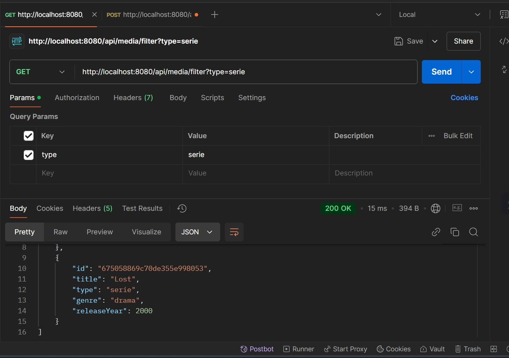
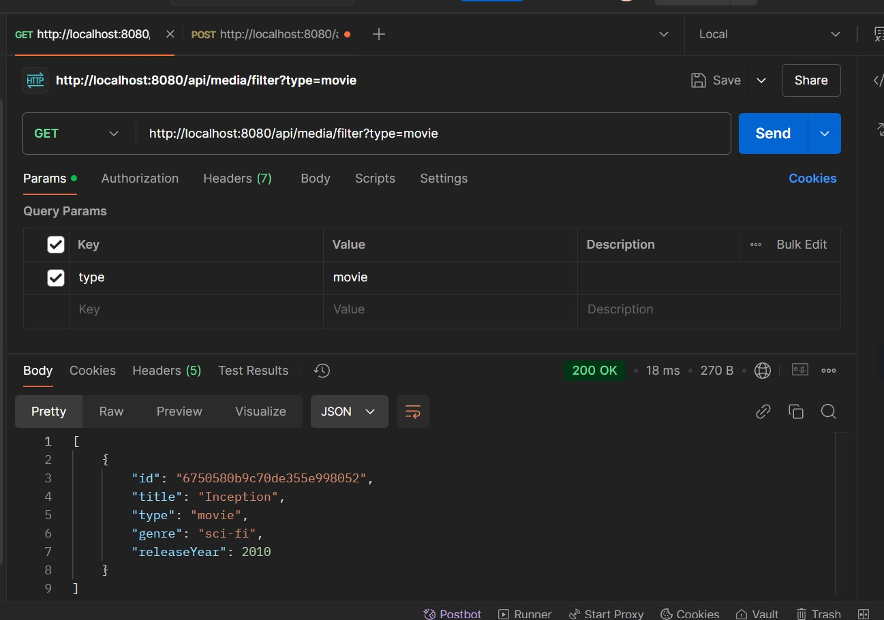
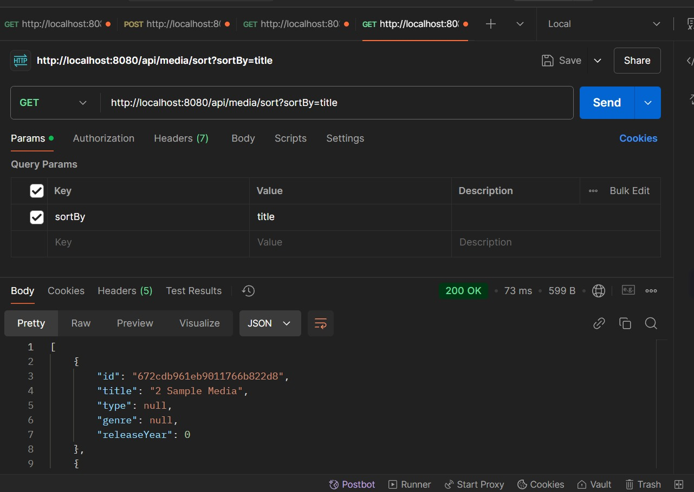
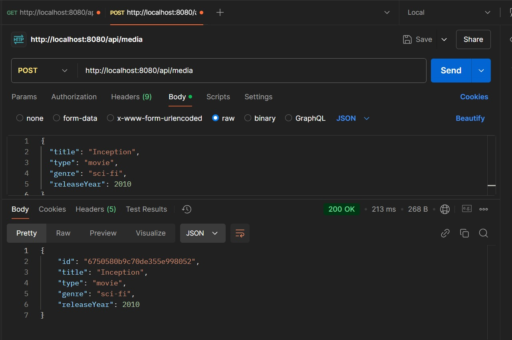
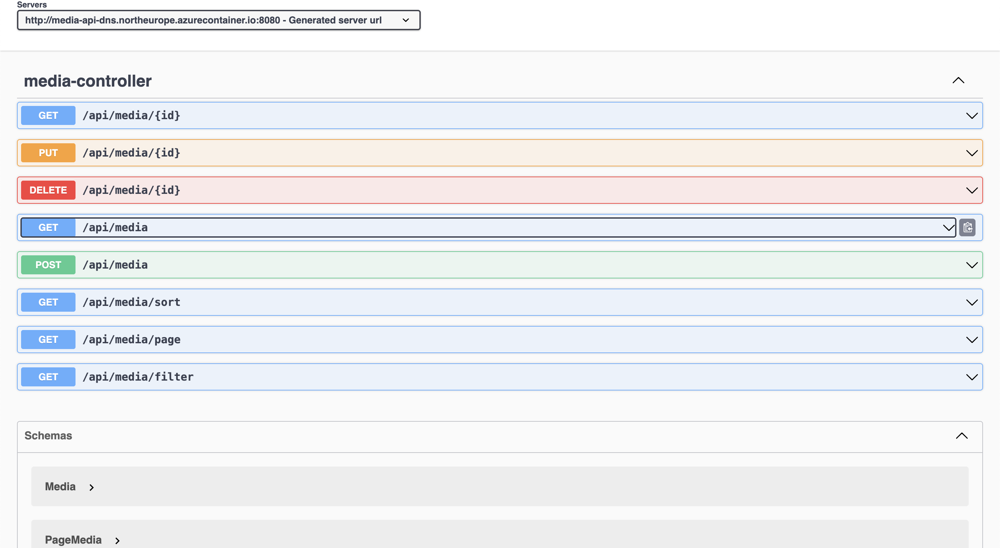

# Multimedia Management API

This project is a **Multimedia Management API** built with **Java Spring Boot**.

## Overview

The Multimedia Management API enables the organization and retrieval of different types of multimedia content such as films, music, and series. It provides features for managing metadata like title, category (e.g., movie, music), genre, and release year.

## Access the API

Access the API through the following interface to try its functionalities:

## [API Interface](http://multimedia-api.cloud.northeurope.azurecontainer.io:8080/swagger-ui/index.html)

## Development Steps

### Database Configuration

Configured a cloud-hosted database to store multimedia records. Used a scalable NoSQL solution for easy querying and management.

### Application Structure

Developed the core application by implementing key components:

- **Data Models** for defining multimedia properties.
- **Database Layer** for handling storage and retrieval.
- **Business Logic Layer** to process data.
- **API Controllers** to expose endpoints.

### Additional Functionalities

Enhanced the API with these capabilities:

- **Search Filters**: Query multimedia based on attributes.
- **Sorting**: Order results by fields like release year or title.
- **Pagination**: Retrieve a manageable number of records per request.

### Testing

The API endpoints were tested using **Postman**, ensuring reliable performance and correct outputs.

  
  
  

### API Documentation

Integrated **Swagger UI** for interactive API documentation. This interface details the endpoints and their usage.

### Configuration

- Secured database credentials in configuration files.
- Enabled filter, sort, and pagination functionalities within the API.

### Deployment Process

Deployed the application to a cloud environment using containerization. Steps included:

1. Setting up a resource group and container registry in the cloud provider.
2. Building and pushing a Docker image to the registry.
3. Launching the containerized app in the cloud for public access.
